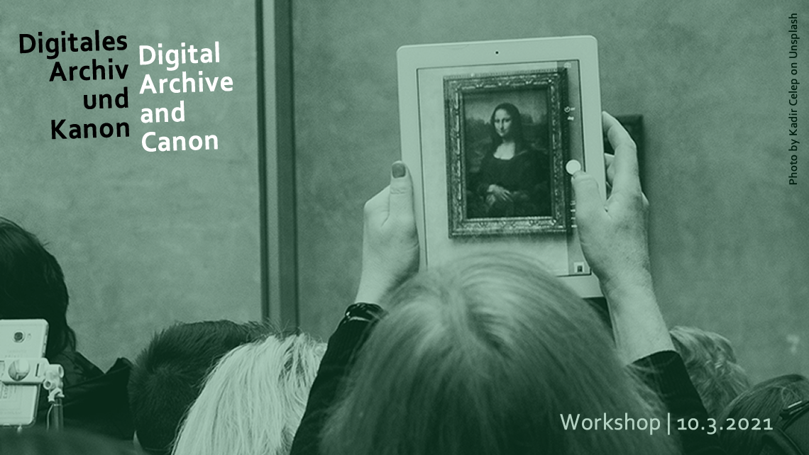

<section lang="de" markdown="1">

# Digitales Archiv und Kanon

Die frühe Kanondebatte hat in den 1970er Jahren die grundlegende Frage gestellt, wessen Werke eigentlich publiziert, rezensiert und damit potentiell kanonisiert werden. Aktualisiert muss diese Frage heute lauten, wessen Werke und welche Objekte in welcher Form wie digitalisiert werden – die ‚Kanonfrage 2.0‘.

Am 10.3.21 wird das zweite Maximilian-Bickhoff-Kolloquium stattfinden, das unter dem Thema "Digitales Archiv und Kanon" steht.
Der virtuelle Workshop zielt auf Austausch und versteht sich als Einladung, diese Frage aus unterschiedlichen Blickwinkeln zu reflektieren, um sich auf interdisziplinärer Ebene der Problematik zu stellen. Bei Interesse an einer Teilnahme an der virtuellen Veranstaltung kontaktieren Sie bitte: corinna.dziudzia@ku.de und mark.hall@open.ac.uk

</section>
<section lang="en" markdown="1">

# Digital Archive and Canon

The canon debate of the 1970s asked the fundamental question of which authors’ works are published, reviewed, and thus available for canonisation. Today this question needs to be rephrased to ask which author’s works and which objects are digitised in what form,  the “canon question 2.0”.

On the 10.3.21 the 2nd Maximillian-Bickhoff-Kolloquium will take place regarding the topic "Digital Archive and Canon".
The virtual workshop sees itself as a venue to promote the exchange of ideas and as an invitation to reflect on this question from a range of interdisciplinary standpoints. If you are interested in participating in the virtual event please contact: corinna.dziudzia@ku.de and mark.hall@open.ac.uk

</section>

<video class="video-js" controls preload="none" width="640" height="360" poster="/images/Introduction.jpg" data-setup="{}" style="margin:0 auto;">
  <source src="https://media.room3b.eu/dac_21/Introduction.webm" type="video/webm" />
  <source src="https://media.room3b.eu/dac_21/Introduction.mp4" type="video/mp4" />
  
To view this video please enable JavaScript, and consider upgrading to a web browser that
    <a href="https://videojs.com/html5-video-support/" target="_blank">supports HTML5 video</a>
  

</video>
