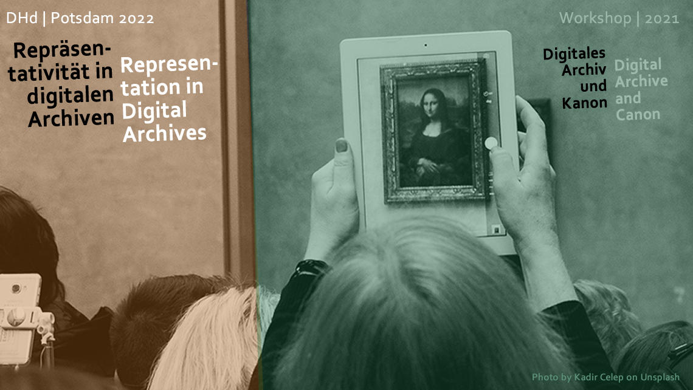

<section lang="de" markdown="1">

# Repräsentativität in digitalen Archiven

Die frühe Kanondebatte hat in den 1970er Jahren die grundlegende Frage gestellt, wessen Werke eigentlich publiziert, rezensiert und damit potentiell kanonisiert werden. Aktualisiert muss diese Frage heute lauten, wessen Werke und welche Objekte in welcher Form wie digitalisiert werden – die ‚Kanonfrage 2.0‘.

Aufbauend auf dem Erfolg des Workshops [Digitales Archiv und Kanon 2021](/dac2021) freuen wir uns zu Position Statements und zur Teilnahme am Workshop "Repräsentativität in digitalen Archiven 2022"  einzuladen. Der Workshop wird im Rahmen der [Digital Humanities im deutschsprachigen Raum 2022 Konferenz](https://www.dhd2022.de/) in Potsdam (Deutschland) stattfinden.
</section>
<section lang="en" markdown="1">

# Representation in Digital Archives

The canon debate of the 1970s asked the fundamental question of which authors’ works are published, reviewed, and thus available for canonisation. Today this question needs to be rephrased to ask which author’s works and which objects are digitised in what form,  the 'canon question 2.0'.

Building on the success of the [Digital Archive and Canon 2021](/dac2021) workshop, we are pleased to be able to invite position statements and participation at the "Representation in digital Archives 2022" workshop, which will be held at the [Digital Humanities im deutschsprachigen Raum 2022 conference](https://www.dhd2022.de/) in Potsdam (Germany).
</section>

